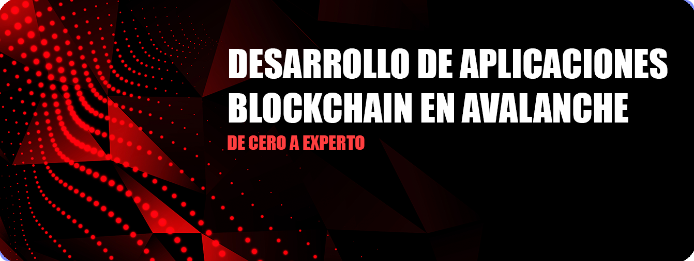

---
layout:
  title:
    visible: true
  description:
    visible: false
  tableOfContents:
    visible: true
  outline:
    visible: true
  pagination:
    visible: true
---

# 🔺 Desarrollo de Aplicaciones Blockchain en Avalanche

¡El mejor curso para convertirte en un experto desarrollador blockchain especializado en la red de Avalanche!.

A través de 24 sesiones aprenderás desde los fundamentos de blockchain hasta crear tu propia blockchain L1 de Avalanche y lanzar tus propios contratos inteligentes en ella.

No te preocupes si no tienes conocimientos en desarrollo ni en blockchain, iremos paso a paso y desde  cero, además tendrás retos luego de terminar cada sesión para que pongas en práctica tus conocimientos.

<figure><figcaption></figcaption></figure>
