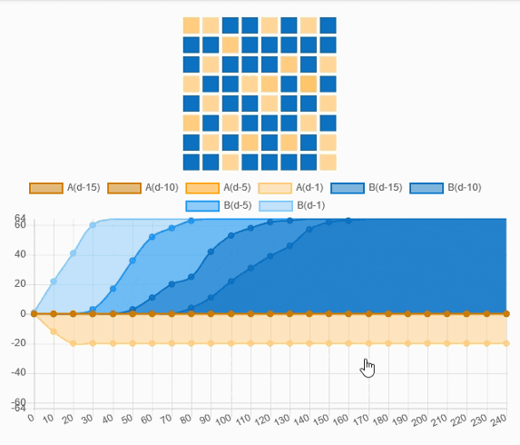

# Mecanismos de Consenso

Uno de los pilares fundamentales que hizo posible el funcionamiento de Bitcoin fue el mecanismo de consenso llamado **Proof of Work** (Prueba de Trabajo). Este sistema permite que todos los **nodos** de la red estén de acuerdo sobre el estado de la blockchain sin necesidad de una autoridad central.

Pero, ¿qué es un nodo? Un nodo es cualquier dispositivo, como una computadora que se conecta a la blockchain y mantiene una copia actualizada de toda la cadena de bloques, participando en la validación y propagación de transacciones.

### Proof of Work

Los mineros, que son nodos especiales, compiten por resolver complejos problemas matemáticos, y el primero en encontrar la solución puede agregar el siguiente bloque de transacciones a la cadena, recibiendo una recompensa por su esfuerzo.

<figure><figcaption>
<a href="https://whiteboardcrypto.com/what-is-proof-of-work/">https://whiteboardcrypto.com/what-is-proof-of-work/</a>
</figcaption></figure>

Sin embargo, con el crecimiento de la red y el aumento en la dificultad de los cálculos, **Proof of Work** ha mostrado ciertas limitaciones. El alto consumo energético y la lentitud en la confirmación de transacciones se han convertido en grandes obstáculos en el camino. Fue entonces cuando surgieron nuevas propuestas para mejorar la eficiencia y escalabilidad de las blockchains.

### Proof of Stake

Aquí entra en juego el **Proof of Stake** (Prueba de Participación). En lugar de depender de la potencia computacional, este mecanismo selecciona a los **validadores** en función de la cantidad de criptomoneda que poseen y están dispuestos a "apostar" como garantía.&#x20;

Pero, ¿quiénes son estos validadores? Los validadores en **Proof of Stake** son participantes de la red que bloquean una parte de sus monedas como compromiso de que actuarán de manera honesta. Si validan transacciones fraudulentas pueden perder sus fondos apostados. Esto reduce drásticamente el consumo de energía y acelera el proceso de validación de transacciones.&#x20;

<figure><figcaption>
<a href="https://tangem.com/en/blog/post/proof-of-stake-pos-the-main-concept-and-principles/">https://tangem.com/en/blog/post/proof-of-stake-pos-the-main-concept-and-principles/</a>
</figcaption></figure>

**Ethereum** reconociendo estas ventajas hizo su transición de Proof of Work a Proof of Stake con el objetivo de mejorar su rendimiento y escalabilidad. Pero la innovación en mecanismos de consenso no se detiene ahí. En 2020, surge **Avalanche**, un ecosistema blockchain que introduce un nuevo y revolucionario protocolo de consenso conocido como **Avalanche Consensus**. Este mecanismo combina lo mejor de los sistemas anteriores y añade mejoras significativas.

### Avalanche Consensus

**Avalanche Consensus** usa un enfoque basado en la "metastabilidad" y muestreo aleatorio repetido, es decir, en lugar de que todos los nodos validen todas las transacciones, cada nodo consulta a un pequeño subconjunto aleatorio de otros nodos. A través de múltiples rondas de consulta, la red **llega rápidamente a un acuerdo** sin sacrificar la seguridad ni la descentralización.

Este método permite que **Avalanche** alcance tiempos de finalización de transacciones de **menos de un segundo** y una capacidad para procesar **miles de transacciones por segundo**. Además es altamente resistente a ataques y no requiere un alto consumo de energía, lo que la convierte en una de las mejores soluciones actualmente.

<figure><figcaption></figcaption></figure>
