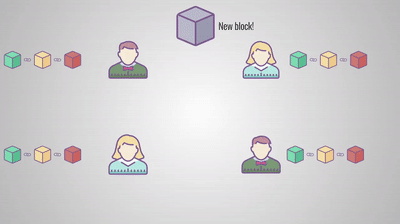

# Qué es Blockchain

Una blockchain es un **registro digital distribuido** donde las **transacciones** se almacenan en **bloques enlazados y cifrados** para asegurar su **seguridad e inmutabilidad**.

Puede ser un poco dificil entenderlo al principio, así de desglosemos aún más esta definición.

* **Registro digital distribuido:** La blockchain funciona como un libro de contabilidad digital que está distribuido entre todos los participantes de la red. Esto significa que cada participante tiene una copia completa del registro, que se actualiza de forma colectiva y automática. Al no haber una autoridad central, se reduce el riesgo de manipulación y aumenta la transparencia.
* **Transacciones**: Son las acciones registradas en la blockchain. Pueden ser transferencias de criptomonedas, ejecución de contratos inteligentes, votaciones, entre otros. Cada transacción es verificada por los nodos de la red antes de ser añadida a un bloque.
* **Bloques enlazados y cifrados**: Las transacciones verificadas se agrupan en “bloques”. Cada bloque está protegido mediante técnicas criptográficas y contiene un enlace al bloque anterior, formando así una cadena continua y segura. La criptografía asegura que la información contenida en los bloques no pueda ser alterada sin que se detecte.
* **Seguridad e inmutabilidad**: Gracias al uso de la criptografía y al modo en que los bloques están enlazados, una vez que una transacción es añadida a la blockchain, no puede ser modificada ni eliminada. Esto hace que el sistema sea altamente seguro y que los registros sean inmutables, o sea, permanentes y no alterables, lo que genera confianza entre los usuarios.

<figure><figcaption></figcaption></figure>

En pocas palabras, una blockchain es un libro digital compartido entre muchas personas donde se guardan transacciones. Estas transacciones se agrupan en bloques que están conectados entre sí de manera segura. Una vez que algo se registra, no se puede cambiar, lo que garantiza su seguridad y permanencia.
