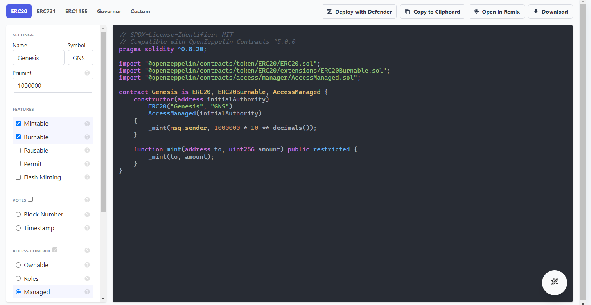

# Creando Proyecto en Next.js

Imagina un Ferrari sin volante. Tremendo motor, carrocería, todo impecable… pero nadie lo conduce. Así se siente un smart contract sin frontend.
\
Además, los usuarios no van a abrir una consola y lanzar `cast send ...` para probar tu obra maestra. Necesitan botones, colores, mensajes de “éxito” o “error”.

Next.js es, en una frase, un “super-framework” construido encima de React. React solo se encarga de pintar cosas en pantalla, todo lo demás (rutas, optimización, servidores, SEO, etc.) toca montarlo a mano o con librerías sueltas. Ahí entra Next.

### Creando proyecto de Next.js

Abre tu terminal favorita y introduce este comando

```bash
npx create-next-app@latest nft-whitelist-dapp
```

Te saldrán algunas preguntas, recomiendo dejar todo por defecto o como se ve en la imagen a continuación:

<figure><figcaption></figcaption></figure>

Luego entramos a la carpeta de proyecto, abrimos el VS code y ejecutamos el proyecto en local:

```bash
cd nft-whitelist-dapp
code .
npm run dev
```

Abres [http://localhost:3000](http://localhost:3000) y verás la paginita de bienvenida de Next.

<figure><figcaption></figcaption></figure>

Al abrir nuestro nuevo proyecto en VS code veremos que tenemos un espacio de trabajo con varías carpetas y archivos ya hecho que nos facilitan el trabajo. Vamos a desmenuzarlo carpeta por carpeta.

<figure><figcaption></figcaption></figure>

1.  `.next/` (NO toques, NO subas a Git)\
    Next mete aquí todo lo que transpila: JavaScript, CSS, imágenes optimizadas, server bundles…

    En desarrollo cambia cada vez que guardas un archivo.\
    En producción se genera con next build.
2. `app`\
   Cada carpeta dentro de app es un segmento de URL, cada archivo se comporta distinto:\
   `page.tsx` : El componente que se renderiza en la ruta padre.
   \
   `layout.tsx`: “Marco” que envuelve a todos los hijos (header, \<Providers />, etc.).
3. `public`\
   Aquí va todo el contenido grafico que se vaya a usar en el sitio web, por ejemplo, logos, videos, iconos, etc.
